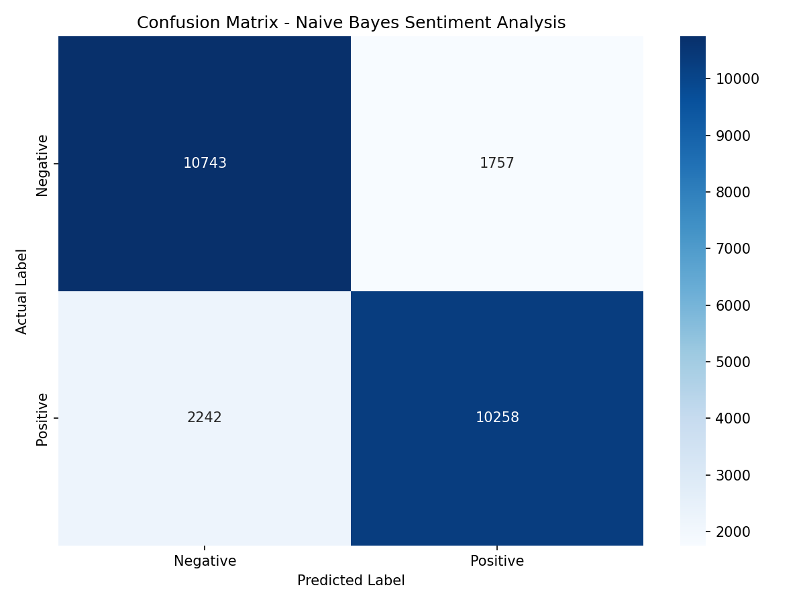

# 🎬 IMDb Movie Review Sentiment Analysis

> **An automated, end-to-end Natural Language Processing (NLP) pipeline for binary sentiment classification using TF-IDF and Multinomial Naive Bayes.**

## 📌 Project Overview
This repository contains a robust machine learning baseline model designed to classify the sentiment of 50,000 IMDb movie reviews. By applying strict text preprocessing (lemmatization, stop-word removal, regex cleaning) and Term Frequency-Inverse Document Frequency (TF-IDF) vectorization, the model categorizes reviews as either Positive or Negative with a solid baseline accuracy of **84.00%**.

Unlike typical academic scripts that require manual dataset configuration, this project features a **fully automated pipeline**. A single execution of `main.py` handles everything from fetching the Stanford dataset to generating visual evaluation metrics.

## ✨ Key Features
* **Zero-Setup Data Fetching:** The script automatically downloads and extracts the 50k Stanford IMDb dataset if it is not found locally.
* **Automated Visualizations:** Automatically generates and saves the Confusion Matrix heatmap into an `images/` directory.
* **Streamlined Architecture:** Uses a single, highly readable script rather than an overly complex, fragmented folder structure.

## ⚙️ Tech Stack & Methodology

| Component | Details |
|---|---|
| Language | Python 3.x |
| Core Libraries | Scikit-learn, NLTK, Pandas, Matplotlib, Seaborn |
| Text Processing | Lowercasing, Regex Cleaning, Stop Word Removal, WordNet Lemmatization |
| Feature Extraction | TF-IDF Vectorization (max_features=5000) |
| Algorithm | Multinomial Naive Bayes |

## 🚀 Quick Start

Because the script handles the data downloading automatically, running this project takes only three commands:

1. **Clone this repository:**
   ```bash
   git clone https://github.com/siliconsagenerd/NLP_Movie_Reviews.git
   cd NLP_Movie_Reviews
   ```

2. **Install dependencies:**
   ```bash
   pip install -r requirements.txt
   ```

3. **Run the pipeline:**
   ```bash
   python main.py
   ```
   > ⏳ On first run, the script will automatically download the dataset (~84MB). Preprocessing 50,000 reviews takes about 1–2 minutes.

## 📊 Results

| Metric | Negative | Positive |
|---|---|---|
| Precision | ~84% | ~84% |
| Recall | ~84% | ~84% |
| F1-Score | ~84% | ~84% |
| **Overall Accuracy** | **84.00%** | |

## 🖼️ Confusion Matrix



## 📁 Project Structure
```
NLP_Movie_Reviews/
├── main.py               # Full pipeline: download → clean → train → evaluate
├── README.md
├── requirements.txt
├── results.txt
├── data/
│   └── dataset_link.txt  # Link to the original Stanford dataset
└── images/
    └── confusion_matrix.png
```

## 📂 Dataset
The 50,000 IMDb movie review dataset is sourced from the [Stanford AI Lab](https://ai.stanford.edu/~amaas/data/sentiment/) and is **downloaded automatically at runtime**. You do not need to download it manually.

## 📄 License
This project is open source and available under the [MIT License](LICENSE).
